UnkIRC

<div align="center">

Secure Terminal IRC · End-to-End Encrypted · Modern TUI

https://img.shields.io/badge/version-1.0.0-blue
https://img.shields.io/badge/license-MIT-green
https://img.shields.io/badge/platform-Linux%20%7C%20macOS-lightgrey

A sophisticated terminal-based IRC client with military-grade encryption and btop-inspired interface

</div>

✨ Overview

UnkIRC redefines secure communication with an elegant terminal interface that combines the power of classic IRC with modern encryption standards. Featuring a stunning btop-inspired design, it ensures your conversations remain private through end-to-end encryption without storing any data on servers.

https://via.placeholder.com/800x400/1a1b26/ffffff?text=UnkIRC+Modern+TUI+Interface

🚀 Features

🔐 Security First

· AES-256-GCM Encryption - Military-grade message protection
· End-to-End Encryption - Only clients hold decryption keys
· Zero Server Storage - Messages never persist on IRC servers
· Perfect Forward Secrecy - Key exchange protocols

🎨 Sophisticated Interface

· btop-inspired Design - Modern, responsive terminal UI
· Rich Color Schemes - Customizable themes and palettes
· Real-time Updates - Live user lists and message streams
· Intuitive Navigation - Keyboard-driven workflow

⚡ Performance

· Native C/C++ - Lightning-fast performance
· Minimal Resource Usage - Efficient memory footprint
· Global Installation - System-wide command access
· Auto Configuration - Smart defaults with customization

🛠 Installation

Quick Install

```bash
curl -fsSL https://unkirc.dev/install.sh | bash
```

Manual Build

```bash
# Clone repository
git clone https://github.com/unkirc/UnkIRC.git
cd UnkIRC

# Build and install
mkdir build && cd build
cmake -DCMAKE_BUILD_TYPE=Release ..
make -j$(nproc)
sudo make install
```

Package Manager

```bash
# Arch Linux (AUR)
yay -S unkirc

# Ubuntu/Debian (soon)
sudo apt install unkirc
```

💻 Usage

Basic Connection

```bash
# Auto-configure with defaults
UnkIRC

# Custom server and credentials
UnkIRC irc.libera.chat 6697 username

# Secure TLS connection
UnkIRC --tls irc.secure.net 6697
```

Commands Reference

Command Shortcut Description
/join #channel /j Join channel
/msg user message /m Private message
/users /u List online users
/key user /k Exchange encryption keys
/help /h Show command help
/quit /q Exit application

🏗 Architecture

```mermaid
graph TB
    A[TUI Layer] --> B[Client Core]
    B --> C[Encryption Engine]
    B --> D[Network Handler]
    C --> E[Local Storage]
    D --> F[IRC Server]
    
    style A fill:#1a1b26
    style C fill:#1a1b26
```



Core Components

· SophisticatedTUI - Modern terminal interface with btop aesthetics
· CryptoManager - AES-256-GCM & RSA encryption handlers
· IRCClient - Protocol implementation and connection management
· ConfigManager - Persistent configuration and user preferences

🔧 Configuration

UnkIRC automatically creates configuration in ~/.config/UnkIRC/:

```ini
# ~/.config/UnkIRC/config.cfg
server_host = irc.libera.chat
server_port = 6667
username = your_username
theme = dark
encryption_enabled = true
```

🎨 Themes

Choose from multiple built-in themes:

```bash
# Set theme
UnkIRC --theme dracula
UnkIRC --theme nord
UnkIRC --theme solarized
```

Available themes: dark, light, dracula, nord, solarized

🔒 Security Model

Encryption Flow

1. RSA Key Exchange - Secure initial handshake
2. AES-256-GCM Session - Fast symmetric encryption
3. Message Authentication - Guaranteed message integrity
4. Perfect Forward Secrecy - Compromise resistance

No Data Persistence

· Messages encrypted before transmission
· Server acts as dumb message relay
· Decryption keys never leave client devices
· Local storage encrypted at rest

📦 Dependencies

Library Purpose Version
ncurses Terminal UI ≥ 6.0
OpenSSL Cryptography ≥ 1.1.1
CMake Build system ≥ 3.12

🤝 Contributing

We welcome contributions! Please see our Contributing Guide for details.

1. Fork the repository
2. Create a feature branch (git checkout -b feature/amazing-feature)
3. Commit changes (git commit -m 'Add amazing feature')
4. Push to branch (git push origin feature/amazing-feature)
5. Open a Pull Request

📄 License

Distributed under the MIT License. See LICENSE for more information.


---

<div align="center">

UnkIRC - Where classic IRC meets modern security

Website • Documentation • Download

</div>
