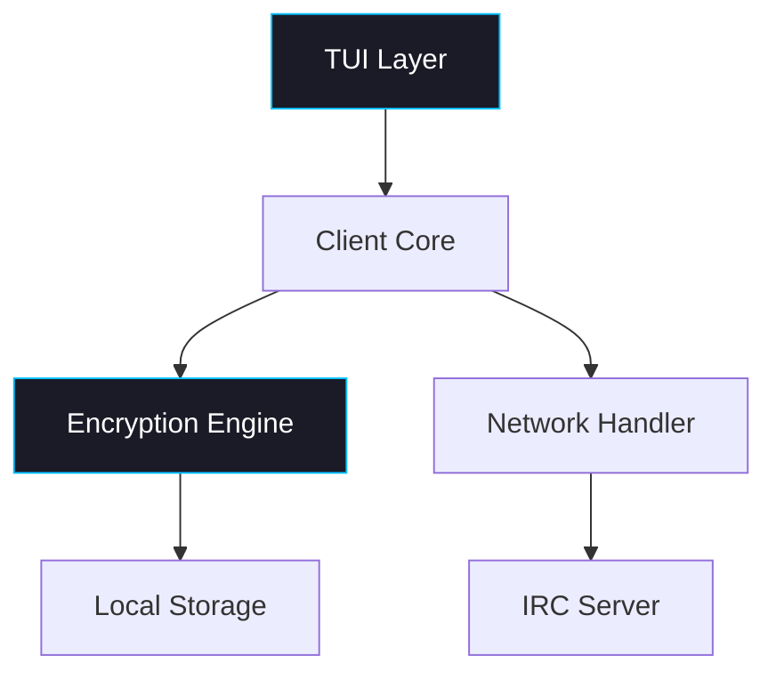

# 🛰️ UnkIRC — Secure Terminal IRC Client

<div align="center">

**Secure · Encrypted · Modern TUI**  
<sub><i>Classic IRC, redefined with military-grade encryption and a modern terminal interface.</i></sub>

<br><br>


</div>

---

## ✨ Visão Geral

**UnkIRC** redefine a comunicação segura em terminais, combinando a essência do IRC clássico com criptografia moderna e uma interface inspirada no **btop**.  
Cada mensagem é protegida por **criptografia de ponta a ponta**, garantindo privacidade total — sem armazenamento de dados em servidores.

<div align="center">
  
</div>

---

## 🚀 Principais Recursos

### 🔐 Segurança em Primeiro Lugar
- **AES-256-GCM** — Criptografia de nível militar  
- **End-to-End Encryption** — Somente os clientes possuem as chaves de decriptação  
- **Zero Storage** — Nenhuma mensagem é salva no servidor  
- **Perfect Forward Secrecy** — Chaves trocadas dinamicamente a cada sessão  

### 🎨 Interface Sofisticada
- **Design inspirado no btop** — Terminal moderno e fluido  
- **Temas e Paletas** — Cores personalizáveis e contrastes otimizados  
- **Atualizações em Tempo Real** — Lista de usuários e mensagens dinâmicas  
- **Navegação Intuitiva** — Totalmente controlada por teclado  

### ⚡ Desempenho
- **C/C++ Nativo** — Execução ultrarrápida e leve  
- **Baixo Consumo** — Uso eficiente de CPU e memória  
- **Configuração Inteligente** — Detecção automática com personalização opcional  
- **Disponível Globalmente** — Instalação via sistema ou AUR  

---

## 🛠️ Instalação

### Instalação Rápida

```bash
curl -fsSL https://unkirc.dev/install.sh | bash
```

### Compilação Manual

```bash
# Clonar repositório
git clone https://github.com/unkirc/UnkIRC.git
cd UnkIRC

# Compilar e instalar
mkdir build && cd build
cmake -DCMAKE_BUILD_TYPE=Release ..
make -j$(nproc)
sudo make install
```

### Gerenciadores de Pacotes

```bash
# Arch Linux (AUR)
yay -S unkirc

# Ubuntu/Debian (em breve)
sudo apt install unkirc
```

---

## 💻 Uso

### Conexão Básica

```bash
# Inicialização padrão
UnkIRC

# Servidor e usuário customizados
UnkIRC irc.libera.chat 6697 seu_usuario

# Conexão segura via TLS
UnkIRC --tls irc.secure.net 6697
```

### Comandos Principais

| Comando | Atalho | Descrição |
|:--------|:-------|:-----------|
| `/join #canal` | `/j` | Entrar em um canal |
| `/msg user mensagem` | `/m` | Enviar mensagem privada |
| `/users` | `/u` | Listar usuários online |
| `/key user` | `/k` | Trocar chaves de criptografia |
| `/help` | `/h` | Mostrar ajuda de comandos |
| `/quit` | `/q` | Encerrar sessão |

---

## 🧩 Arquitetura



### Componentes Principais
- **SophisticatedTUI** — Interface moderna e responsiva no terminal  
- **CryptoManager** — Manipulação AES-256-GCM e RSA  
- **IRCClient** — Implementação do protocolo e controle de sessão  
- **ConfigManager** — Gerenciamento de preferências e configurações persistentes  

---

## ⚙️ Configuração

Arquivo gerado automaticamente em `~/.config/UnkIRC/config.cfg`:

```ini
server_host = irc.libera.chat
server_port = 6667
username = seu_usuario
theme = dark
encryption_enabled = true
```

---

## 🎨 Temas

Escolha entre múltiplos temas embutidos:

```bash
UnkIRC --theme dracula
UnkIRC --theme nord
UnkIRC --theme solarized
```

Temas disponíveis: `dark`, `light`, `dracula`, `nord`, `solarized`

---

## 🔒 Modelo de Segurança

### Fluxo de Criptografia
1. **Troca de Chaves RSA** — Handshake inicial seguro  
2. **Sessão AES-256-GCM** — Criptografia simétrica veloz  
3. **Autenticação de Mensagens** — Garantia de integridade  
4. **Perfect Forward Secrecy** — Resistência a compromissos futuros  

### Nenhum Dado Persistente
- Mensagens **criptografadas antes do envio**  
- Servidor atua apenas como **relé cego**  
- Chaves privadas **nunca deixam o cliente**  
- Armazenamento local **criptografado em repouso**  

---

## 📦 Dependências

| Biblioteca | Finalidade | Versão |
|:-----------|:------------|:-------|
| **ncurses** | Interface de terminal | ≥ 6.0 |
| **OpenSSL** | Criptografia | ≥ 1.1.1 |
| **CMake** | Sistema de build | ≥ 3.12 |

---

## 🤝 Contribuindo

Quer ajudar a evoluir o UnkIRC? É simples:

1. Faça um fork do repositório  
2. Crie um branch de feature:  
   ```bash
   git checkout -b feature/nova-funcionalidade
   ```
3. Commit suas alterações:  
   ```bash
   git commit -m "Adiciona nova funcionalidade"
   ```
4. Envie para seu fork:  
   ```bash
   git push origin feature/nova-funcionalidade
   ```
5. Abra um **Pull Request**

---

## 📄 Licença

Distribuído sob a **MIT License**.  
Consulte o arquivo `LICENSE` para mais detalhes.

---

<div align="center">

<h3>🛰️ UnkIRC</h3>

<b>Onde o IRC clássico encontra a segurança moderna.</b>

<br><br>

[🌐 Website](https://unkirc.dev) • [📘 Documentação](https://docs.unkirc.dev) • [⬇️ Download](https://github.com/unkirc/UnkIRC/releases)

</div>

---

# 📘 docs/overview.md

## 🔭 Introdução

**UnkIRC** é um cliente IRC de terminal com foco em **segurança e design**.  
Inspirado em ferramentas como **btop** e **htop**, ele combina eficiência visual e criptografia avançada para oferecer uma experiência IRC moderna e confiável.

---

## 🧠 Filosofia

> “Simplicidade é a forma mais elevada de sofisticação.”

UnkIRC foi criado para desenvolvedores e entusiastas que valorizam:
- Comunicação direta e sem distrações  
- Segurança real — não apenas “SSL” no nome  
- Controle total sobre seus dados  
- Desempenho e elegância em modo texto  

---

## ⚙️ Estrutura do Projeto

```
UnkIRC/
├── src/
│   ├── core/
│   │   ├── client.cpp
│   │   ├── crypto.cpp
│   │   └── config.cpp
│   ├── tui/
│   │   ├── interface.cpp
│   │   └── colors.cpp
│   └── main.cpp
├── include/
│   ├── client.hpp
│   ├── crypto.hpp
│   ├── config.hpp
│   └── tui.hpp
├── CMakeLists.txt
└── README.md
```

---

## 🧩 Design do Terminal

- **Baseado em ncurses**, com redimensionamento dinâmico  
- **Layouts flexíveis** para janelas, status e canais  
- **Painel lateral** de usuários com highlight de menções  
- **Paleta temática** com cores otimizadas para monitores escuros  

---

## 🔐 Segurança Profunda

- **AES-256-GCM + RSA 4096-bit**  
- **Sessões efêmeras com PFS**  
- **Assinaturas HMAC integradas**  
- **Sem logs locais não criptografados**

---

## 🧰 Roadmap

- [ ] Plugin System  
- [ ] Theme Creator CLI  
- [ ] Cross-platform Windows build  
- [ ] Plugin de Notificações via D-Bus  

---

## 🌍 Contato

- Website: [unkirc.dev](https://unkirc.dev)  
- Email: contact@unkirc.dev  
- GitHub: [github.com/unkirc](https://github.com/unkirc)

---

<p align="center">
  <b>UnkIRC — Comunicação segura, sem ruído.</b>
</p>
